# PokeTeamDex

A full-featured Pokémon team builder and Pokédex browser built with Flutter. Supports offline-first team management with cloud sync, competitive format validation, Pokémon Showdown import/export, and deep Pokémon data browsing across all nine generations.

---

## Table of Contents

1. [Feature Overview](#feature-overview)
2. [Data Sources](#data-sources)
3. [Architecture Overview](#architecture-overview)
4. [Frontend — Flutter App](#frontend--flutter-app)
   - [Navigation & Routing](#navigation--routing)
   - [State Management](#state-management)
   - [Local Database (Drift)](#local-database-drift)
   - [Feature Modules](#feature-modules)
   - [Services Layer](#services-layer)
   - [Format Engine](#format-engine)
5. [Backend — FastAPI](#backend--fastapi)
   - [API Endpoints](#api-endpoints)
   - [Database Models](#database-models)
   - [Authentication](#authentication)
6. [Sync System](#sync-system)
   - [Push Phase](#push-phase)
   - [Pull Phase](#pull-phase)
   - [Conflict Resolution](#conflict-resolution)
7. [Data Flow Diagrams](#data-flow-diagrams)
8. [Local Development Setup](#local-development-setup)
9. [Deploying the Backend](#deploying-the-backend)
10. [Deploying the Frontend](#deploying-the-frontend)
11. [Testing](#testing)
12. [Project Structure](#project-structure)

---

## Feature Overview

| Area | Features |
|------|----------|
| **Pokédex** | Browse all 1000+ Pokémon, search/filter by gen/type/game, base stats, evolutions, forms, moves, abilities, locations, type effectiveness matrix |
| **Team Builder** | Create/edit teams in folder hierarchy, 6-slot configuration with full stat preview, EV/IV grids, drag-reorder, format picker; responsive overflow menu for reorder actions on mobile |
| **Slot Config** | Ability, nature, held item, 4 moves (generation-aware), EV/IV, level, shiny, gender, friendship, ribbons, Mega/Dynamax/Gigantamax, contest stats, Pokémon identity chains |
| **Reference** | Moves, Items, Abilities, Types, Natures, Locations browsers |
| **Sync** | Offline-first — all data local; bidirectional push/pull sync to PostgreSQL backend |
| **Format Engine** | Pokémon Showdown learnset validation, generation-specific mechanics, 32 competitive formats |
| **PS Integration** | Import teams from `.txt`, export Showdown-format text, write to local PS teams directory |
| **Desktop** | System tray, native window management, persistent nav drawer |
| **Platforms** | iOS, Android, macOS, Windows, Linux, Web |

---

## Data Sources

| Source | What we use it for |
|--------|-------------------|
| [PokéAPI](https://pokeapi.co/docs/v2) | Pokémon species, base stats, types, abilities, moves, evolutions, locations, and all other Pokédex data |
| [PokéAPI Sprites](https://github.com/PokeAPI/sprites) | Front/back sprites and official artwork for every Pokémon and form |
| [Pokémon Showdown data](https://play.pokemonshowdown.com/data/) | Learnsets, move stats, item data, ability data, and competitive format definitions |
| [Smogon/pokemon-showdown](https://github.com/smogon/pokemon-showdown) | Source repository for the PS data files pulled by `scripts/sync_ps_data.py` |
| [Smogon Sprites](https://github.com/smogon/sprites) | Animated and generation-specific sprites used in the team builder and slot config |

PS data is downloaded and trimmed by `scripts/sync_ps_data.py` and bundled into `assets/data/ps/`. The app checks a SHA hash on startup and auto-downloads updates from the backend when the data changes upstream.

---

## Architecture Overview

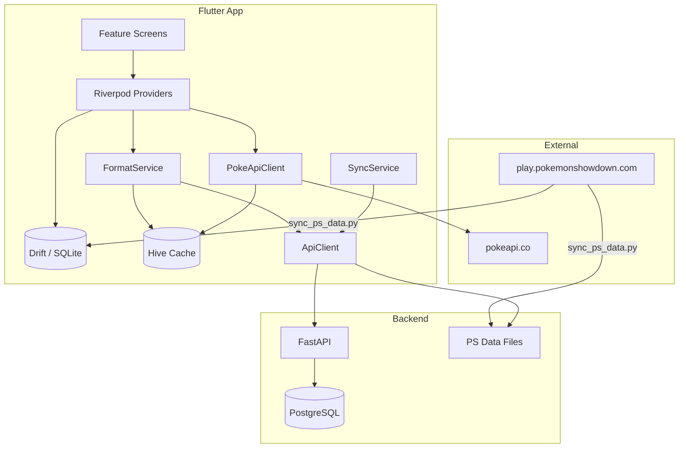

---

## Frontend — Flutter App

### Navigation & Routing

The app uses **GoRouter 17** with a `StatefulShellRoute` for persistent bottom navigation. The shell adapts to screen width automatically.

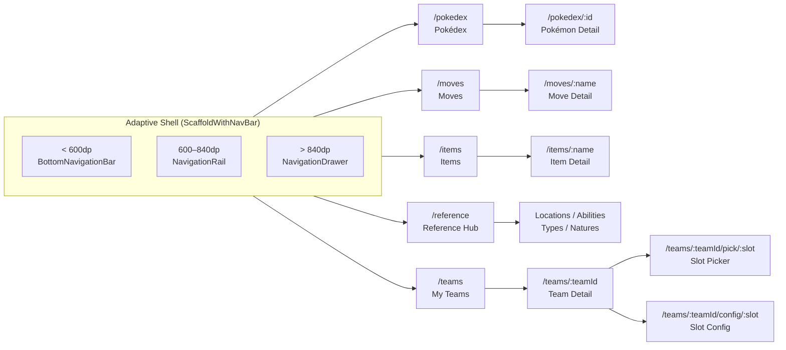

**Auth redirect**: GoRouter redirect guard checks `authTokenProvider`. Unauthenticated users can browse everything locally; sync-requiring actions redirect to `/login`.

### State Management

All state flows through **Riverpod 3**. Providers are composed hierarchically:

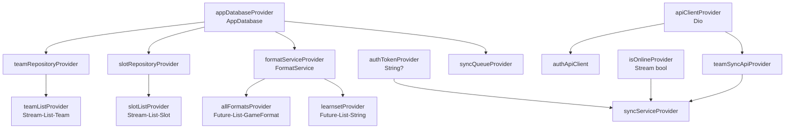

Key provider patterns used:
- **`StreamProvider`** — live DB queries via Drift (team list, slot list, folders)
- **`FutureProvider`** — one-shot async data (format lists, learnsets, PokéAPI calls)
- **`FutureProvider.autoDispose.family`** — per-slot/per-Pokémon data that disposes when not in view
- **`Notifier`** — mutable state (pending sync count, connectivity status)

### Local Database (Drift)

Drift provides a type-safe SQLite ORM with code generation. The database uses **schema v12** with 9 tables.

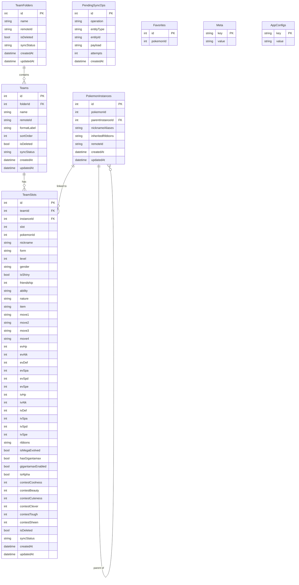

**Migrations** run in sequence inside `AppDatabase`:

| Version | Change |
|---------|--------|
| v1 | Initial: Teams, TeamSlots, TeamFolders, PendingSyncOps, Meta |
| v2 | Slot form + sprite config columns |
| v3 | `is_deleted`, `sync_status` on all entities; `format_label`, `sort_order` on teams |
| v4 | PS import tracking fields |
| v5 | AppConfigs table |
| v6 | Favorites table |
| v7 | Contest stat columns (6×) on TeamSlots |
| v8 | Ribbons JSON column; Mega/Dynamax/Alpha booleans |
| v9 | PokemonInstances table; `instance_id` FK on TeamSlots |
| v10 | `gigantamax_enabled` on TeamSlots |
| v11 | `is_box` on Teams |
| v12 | `tera_type` on TeamSlots |

### Feature Modules

Each feature lives in `lib/features/<name>/` with a consistent internal structure:

```
lib/features/<name>/
├── presentation/          # Screens + widgets
│   ├── <name>_screen.dart
│   └── widgets/
├── providers/             # Riverpod providers (business logic)
└── data/                  # Static data / models (where applicable)
```

| Feature | Key Screens | Notes |
|---------|-------------|-------|
| `pokedex` | `PokemonListScreen`, `PokemonDetailScreen` | Tabs: Overview, Stats, Abilities, Moves, Evolutions, Forms, Locations; Hero animation on sprite |
| `teams` | `TeamsScreen`, `TeamDetailScreen`, `SlotPickerScreen`, `SlotConfigScreen` | Full team builder; wide layout shows slot config panel inline |
| `moves` | `MovesScreen`, `MoveDetailBottomSheet` | Type filter, damage class filter, Z/Max/G-Max chips |
| `items` | `ItemsScreen`, `ItemDetailBottomSheet` | Pocket filter, sort toggle |
| `abilities` | `AbilitiesScreen`, `AbilityDetailBottomSheet` | Gen filter |
| `types` | `TypesScreen` | 18×18 effectiveness matrix |
| `locations` | `LocationsScreen`, `LocationDetailScreen` | Region browser, version filter |
| `natures` | `NaturesScreen` | 25 natures table |
| `auth` | `LoginScreen`, `RegisterScreen` | JWT, keyboard submit, sync on login |
| `settings` | `SettingsScreen`, `SyncMonitorScreen` | Theme, accent colour, API URL, sync history |

### Services Layer

```
lib/services/
├── api/
│   ├── api_client.dart          # Dio instance + auth header injection
│   ├── auth_api.dart            # login / register HTTP calls
│   └── team_sync_api.dart       # push / pull endpoint wrappers
├── connectivity/
│   └── connectivity_provider.dart  # Stream<bool> via connectivity_plus
├── format/
│   ├── format_service.dart      # PS data loading & querying
│   ├── format_models.dart       # GameFormat, GenerationMechanics, PsMoveEntry…
│   ├── format_providers.dart    # Riverpod FutureProviders for format data
│   ├── slot_validator.dart      # SlotValidation — move/item/ability legality flags
│   └── sprite_resolver.dart     # Picks sprite URL by generation + form
├── pokeapi/
│   ├── poke_api_client.dart     # Dio for pokeapi.co
│   ├── poke_api_repository.dart # fetchPokemon, fetchSpecies, fetchEncounters…
│   ├── poke_api_cache.dart      # Hive TTL cache (24h lists, 7d details)
│   ├── poke_api_providers.dart  # Riverpod providers
│   └── models/                  # PokemonEntry, PokemonSpeciesEntry, etc.
├── sync/
│   ├── sync_service.dart        # Push + pull orchestration
│   ├── sync_providers.dart      # Riverpod wrappers + sync trigger helper
│   └── sync_status.dart         # SyncResult, SyncPhase enums
├── tray/
│   └── tray_service.dart        # System tray icon + menu (desktop only)
├── update/
│   ├── update_service.dart      # GitHub releases API check + semver compare
│   ├── update_info.dart         # UpdateInfo data class (version + per-platform URLs)
│   └── update_provider.dart     # updateCheckProvider FutureProvider<UpdateInfo?>
└── logs/
    └── logs_server_output.dart  # Buffered log forwarder → backend /logs/device
```

### Format Engine

The format engine validates team slots against competitive Pokémon Showdown rules across all nine generations.

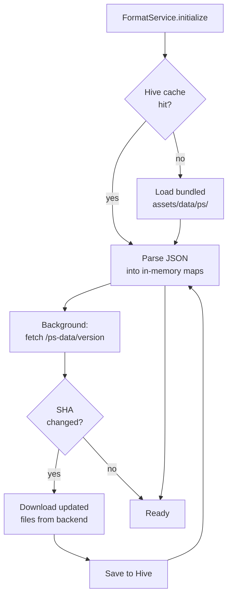

**PS Data files** (in `assets/data/ps/`, populated by `scripts/sync_ps_data.py`):

| File | Contents |
|------|----------|
| `learnsets.json` | Per-Pokémon move lists by learn method and generation |
| `moves.json` | All move stats (type, power, accuracy, PP, Z/Max data) |
| `items.json` | All items (generation introduced, Mega stone / Z-crystal mapping) |
| `abilities.json` | All abilities (name, generation introduced) |
| `formats.json` | 32 competitive format definitions |
| `learnsets-g6-allowlist.json` | Gen 6 legality cross-reference |

**Generation mechanics** enforced by `GenerationMechanics.forGen(n)`:

| Gen | No Abilities | No Held Items | DVs (max 15) | 5 Stats | Stat Exp | No Shiny |
|-----|:-----------:|:-------------:|:------------:|:-------:|:--------:|:--------:|
| 1   | ✓ | ✓ | ✓ | ✓ | ✓ | ✓ |
| 2   | ✓ | — | ✓ | — | ✓ | — |
| 3+  | — | — | — | — | — | — |

---

## Backend — FastAPI

The backend is a stateless FastAPI service. It stores nothing beyond what the client sends — all team data is owned by the client and synced to PostgreSQL.

### API Endpoints

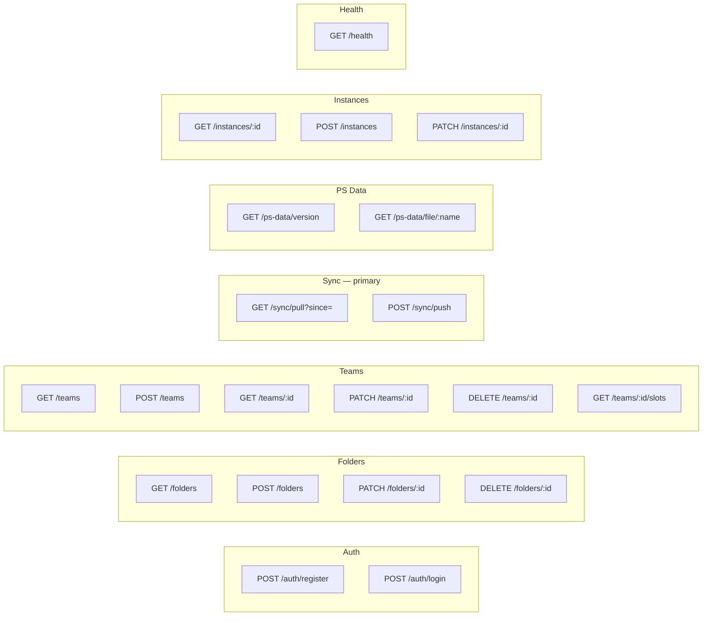

**POST /sync/push** is the primary write endpoint. It accepts a batch of operations that can cross-reference each other by `client_local_id`:

```json
{
  "ops": [
    { "type": "folder_create", "client_local_id": "folder-abc", "name": "Competitive" },
    { "type": "team_create",   "client_local_id": "team-xyz",
      "folder_client_local_id": "folder-abc", "name": "Rain Team", "format_label": "gen9vgc2024" },
    { "type": "slot_upsert",   "team_client_local_id": "team-xyz",
      "slot": 1, "pokemon_id": 6, "level": 50 }
  ]
}
```

Response resolves `client_local_id` → `remote_id` mappings so the app can update its local records:

```json
{
  "created": [
    { "entity_type": "folder", "client_local_id": "folder-abc", "remote_id": 42 },
    { "entity_type": "team",   "client_local_id": "team-xyz",   "remote_id": 17 }
  ]
}
```

**GET /sync/pull?since=2026-01-01T00:00:00Z** returns all entities changed after the given timestamp:

```json
{
  "folders": [...],
  "teams":   [...],
  "instances": [...],
  "slots":   [...]
}
```

### Database Models

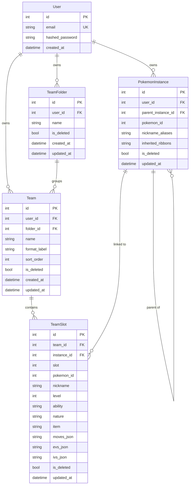

### Authentication

JWT-based auth using `python-jose` with bcrypt password hashing:

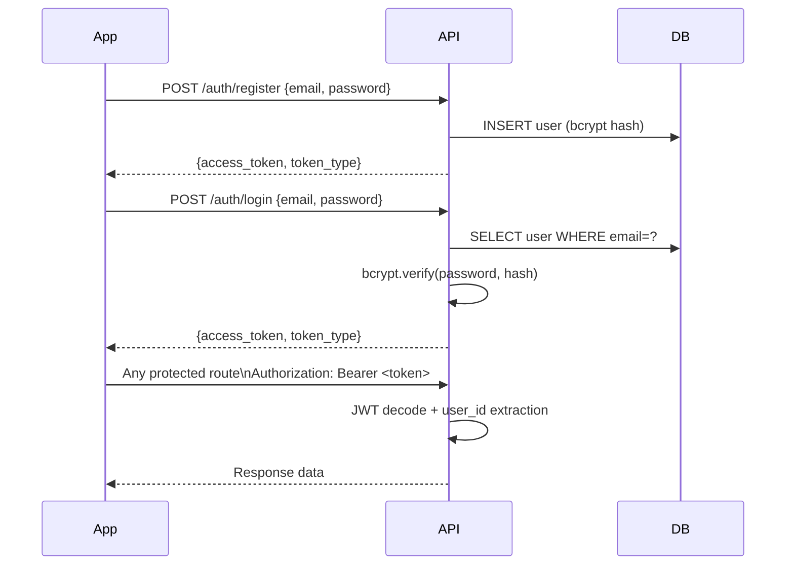

Token lifetime: **30 days** (configurable via `ACCESS_TOKEN_EXPIRE_MINUTES`).

---

## Sync System

The sync system is **offline-first**: every mutation writes to local Drift DB first and enqueues a `PendingSyncOp`. The engine drains the queue whenever connectivity is available.

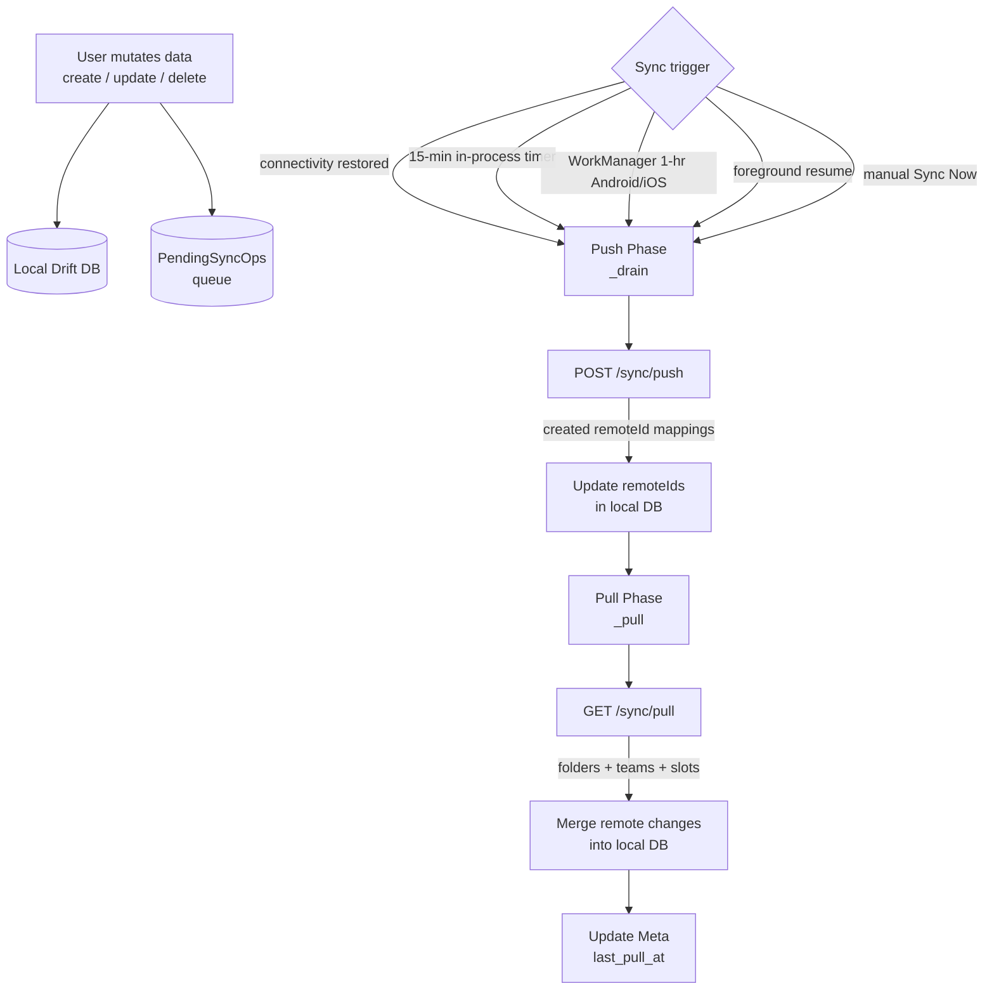

### Push Phase

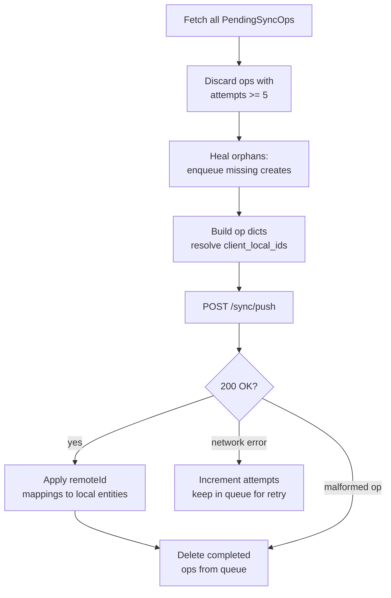

**Orphan healing**: if a `slot_upsert` is in the queue but the parent team already has a `remoteId` (create already pushed), the slot op references the `remoteId` directly. If the team create is still pending, both ops travel in the same batch and cross-reference via `client_local_id`.

### Pull Phase

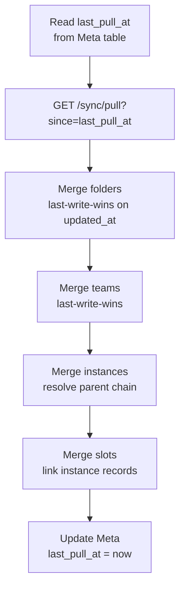

### Conflict Resolution

| Scenario | Resolution |
|----------|-----------|
| Same entity edited locally and remotely | Remote wins if `remote.updated_at > local.updated_at` |
| Entity deleted remotely, edited locally | Remote deletion wins — local entity hard-deleted |
| Entity created locally, not yet on remote | Stays local; next push will create it |
| Entity deleted locally, edited remotely | Local deletion in queue takes precedence |
| Folder deleted remotely with teams inside | Cascade: local teams + slots hard-deleted |

---

## Data Flow Diagrams

### Opening a Team

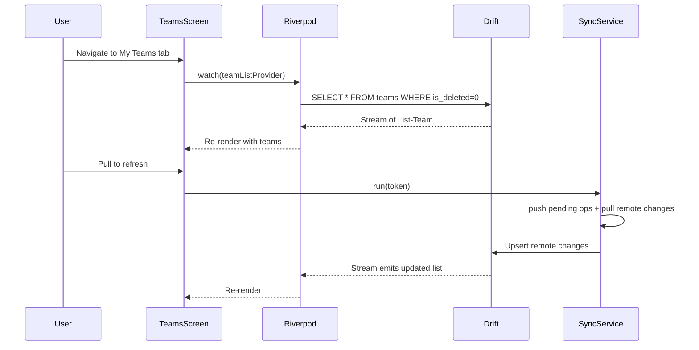

### Configuring a Slot

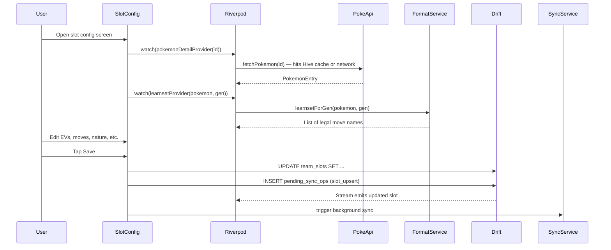

### Pokémon Data Loading

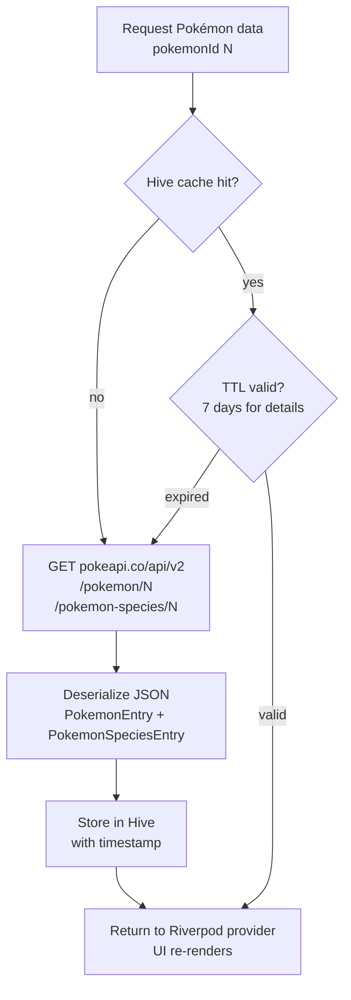

---

## Local Development Setup

### Prerequisites

- Flutter SDK ≥ 3.11.5 / Dart ≥ 3.11.5
- Docker + Docker Compose
- Python 3.12+ (for the PS data sync script)

### 1. Clone and install Flutter dependencies

```bash
git clone https://github.com/KwasiAsante/PokeTeamDex.git
cd poke_team_dex
flutter pub get
```

### 2. Start the backend

```bash
cd backend
cp .env.example .env          # Fill in SECRET_KEY (any random string for dev)
docker-compose up -d          # Starts PostgreSQL on :5432 + FastAPI on :8000
```

The `start.sh` entrypoint runs `alembic upgrade head` automatically before starting uvicorn.

### 3. Populate PS data (one-time)

```bash
pip install requests json5
python scripts/sync_ps_data.py
```

This downloads trimmed Pokémon Showdown JSON files into `assets/data/ps/` and copies version hashes to `backend/app/static/`.

### 4. Regenerate Drift code after schema changes

```bash
dart run build_runner build --delete-conflicting-outputs
```

### 5. Run the app

```bash
flutter run                    # Auto-selects connected device / emulator
flutter run -d chrome          # Web
flutter run -d macos           # macOS desktop
```

Point the app at your local backend: **Settings → API Base URL** → `http://localhost:8000`.

### Environment Variables (backend)

| Variable | Description | Example |
|----------|-------------|---------|
| `DATABASE_URL` | Async PostgreSQL connection string | `postgresql+asyncpg://dev:dev@db:5432/poketeamdex` |
| `SECRET_KEY` | JWT signing secret — use a long random string in production | `openssl rand -hex 32` |
| `ALGORITHM` | JWT algorithm | `HS256` |
| `ACCESS_TOKEN_EXPIRE_MINUTES` | Token lifetime | `43200` (30 days) |

---

## Deploying the Backend

The backend is a stateless FastAPI service that can be deployed anywhere Docker runs.

### Docker Compose (self-hosted / VPS)

`start.sh` runs `alembic upgrade head` automatically before uvicorn starts — **you never need to run migrations manually**. The production compose file (`docker-compose.prod.yml`) runs only the API container; PostgreSQL is an external service configured via `DATABASE_URL` in `.env.prod`.

```bash
cd backend
# First deploy: copy and fill in the env file
cp .env.example .env.prod   # set DATABASE_URL, SECRET_KEY, etc.

# Every deploy (first or subsequent):
docker compose -f docker-compose.prod.yml down
docker compose -f docker-compose.prod.yml up -d

# Verify
curl http://localhost:8000/health
# → {"status": "ok"}
```

> **Local dev** uses `docker-compose.yml` (no suffix), which also spins up a `postgres:16` container so no external DB is needed.

### Railway / Render / Fly.io

1. Point the platform at the `backend/` directory (it has a `Dockerfile`)
2. Set the environment variables in the platform dashboard:
   - `SECRET_KEY`
   - `DATABASE_URL` (the platform's managed PostgreSQL URL)
3. `start.sh` runs migrations then starts the server automatically — no extra step needed:

```bash
# backend/start.sh (runs automatically on container start)
alembic upgrade head
uvicorn app.main:app --host 0.0.0.0 --port ${PORT:-8000}
```

### Alembic Migrations

| Migration | Description |
|-----------|-------------|
| `0001_initial_schema` | Users, teams, folders, slots |
| `0002_nullable_folder` | `folder_id` nullable on teams |
| `0003_add_is_deleted` | Soft-delete + sync status columns |
| `0004_pokemon_instances` | PokemonInstances table |
| `0005_full_slot_config` | All slot config columns (ribbons, contest stats, gimmicks) |
| `0006_add_format_label_to_teams` | `format_label` column on teams |
| `0007_add_tera_type_to_slots` | `tera_type` column on TeamSlots |
| `0008_add_sort_order_and_is_box` | `sort_order` on Teams/TeamFolders; `is_box` on Teams |

```bash
cd backend
alembic upgrade head      # Apply all pending migrations
alembic downgrade -1      # Roll back one step
alembic history           # Show applied migrations
alembic current           # Show current revision
```

### Updating PS Data

When Pokémon Showdown releases format updates, run:

```bash
python scripts/sync_ps_data.py
git add assets/data/ps/ backend/app/static/
git commit -m "chore: update PS data"
# Redeploy backend — clients will detect the SHA change and auto-download
```

---

## Deploying the Frontend

Web, Android, Windows, and Linux release builds are fully automated via GitHub Actions — no manual steps needed after pushing a version tag.

### Web — Firebase Hosting

Deployed automatically to **https://poketeamdex.web.app** on every push to `main` and on every `v*.*.*` tag (`deploy-web.yml`).

### Android — APK

Built and uploaded to the GitHub Release automatically on every version tag. Signed with the keystore stored in GitHub Secrets.

```bash
# Manual build (if needed)
flutter build apk --release
# Output: build/app/outputs/flutter-apk/app-release.apk
```

### Windows — MSI + EXE

Both installers built on every version tag and uploaded to the GitHub Release automatically (`release.yml`).

> **Known issue #96**: the MSI "Launch after Finish" checkbox does not start the app. Use the EXE installer as the primary Windows download.

### Linux — tar.gz, AppImage, Flatpak

Three artifacts are built and uploaded to every GitHub Release automatically (`release.yml`). To build manually:

#### Prerequisites

```bash
sudo apt-get install -y \
  clang cmake ninja-build pkg-config libgtk-3-dev liblzma-dev \
  libfuse2 libayatana-appindicator3-1 libdbusmenu-gtk3-4 \
  flatpak flatpak-builder

flatpak remote-add --user --if-not-exists flathub https://dl.flathub.org/repo/flathub.flatpakrepo
flatpak install --user --noninteractive flathub org.freedesktop.Platform//23.08 org.freedesktop.Sdk//23.08
```

#### 1. Build the Flutter bundle

```bash
flutter build linux --release
```

#### 2. Bundle tray native dependencies

`tray_manager` links against `libayatana-appindicator3`, which must be copied into the bundle so it is available inside AppImage and Flatpak sandboxes.

```bash
LIBDIR=build/linux/x64/release/bundle/lib
for lib in \
  /usr/lib/x86_64-linux-gnu/libayatana-appindicator3.so.1 \
  /usr/lib/x86_64-linux-gnu/libayatana-ido3-0.4.so.0 \
  /usr/lib/x86_64-linux-gnu/libdbusmenu-glib.so.4 \
  /usr/lib/x86_64-linux-gnu/libdbusmenu-gtk3.so.4; do
  [ -e "$lib" ] && cp -L "$lib" "$LIBDIR/$(basename "$lib")"
done
```

#### 3. Package tar.gz

Includes a `.desktop` file, app icon, and `install.sh` for desktop integration.

```bash
TAG=v1.0.7   # replace with actual tag
BUNDLE=build/linux/x64/release/bundle
cp linux/flatpak/io.github.KwasiAsante.PokeTeamDex.desktop "$BUNDLE/"
cp assets/images/app_icon.png "$BUNDLE/io.github.KwasiAsante.PokeTeamDex.png"
cp linux/install.sh "$BUNDLE/install.sh"
chmod +x "$BUNDLE/install.sh"
cd "$BUNDLE" && tar -czf ~/PokeTeamDex-$TAG-linux-x64.tar.gz . && cd -
```

After extracting, users run `./install.sh` once to register the app in their launcher.

#### 4. Build AppImage

Requires `libfuse2`. Run `appimagetool` with `APPIMAGE_EXTRACT_AND_RUN=1` if FUSE is unavailable.

```bash
TAG=v1.0.7
wget -q "https://github.com/AppImage/AppImageKit/releases/download/continuous/appimagetool-x86_64.AppImage" \
  -O /tmp/appimagetool
chmod +x /tmp/appimagetool

mkdir -p /tmp/PokeTeamDex.AppDir
cp -r build/linux/x64/release/bundle/. /tmp/PokeTeamDex.AppDir/

printf '#!/bin/bash\nSELF=$(readlink -f "$0")\nHERE=$(dirname "$SELF")\nexec "$HERE/poke_team_dex" "$@"\n' \
  > /tmp/PokeTeamDex.AppDir/AppRun
chmod +x /tmp/PokeTeamDex.AppDir/AppRun

printf '[Desktop Entry]\nName=PokeTeamDex\nExec=poke_team_dex\nIcon=io.github.KwasiAsante.PokeTeamDex\nType=Application\nCategories=Game;\n' \
  > /tmp/PokeTeamDex.AppDir/io.github.KwasiAsante.PokeTeamDex.desktop
cp assets/images/app_icon.png /tmp/PokeTeamDex.AppDir/io.github.KwasiAsante.PokeTeamDex.png
ln -sf io.github.KwasiAsante.PokeTeamDex.png /tmp/PokeTeamDex.AppDir/.DirIcon

APPIMAGE_EXTRACT_AND_RUN=1 ARCH=x86_64 /tmp/appimagetool \
  /tmp/PokeTeamDex.AppDir ~/PokeTeamDex-$TAG-x86_64.AppImage
```

To run: `chmod +x PokeTeamDex-*.AppImage && ./PokeTeamDex-*.AppImage`. Double-click in a file manager requires `libfuse2` installed on the host.

#### 5. Build Flatpak

```bash
TAG=v1.0.7
flatpak-builder --user --force-clean --disable-rofiles-fuse \
  --repo=flatpak-repo flatpak-build-dir linux/flatpak/manifest.yml
flatpak build-bundle flatpak-repo ~/PokeTeamDex-$TAG.flatpak \
  io.github.KwasiAsante.PokeTeamDex

# Clean up build artefacts
rm -rf flatpak-build-dir flatpak-repo .flatpak-builder
```

To install: `flatpak install PokeTeamDex-*.flatpak`  
To run: `flatpak run io.github.KwasiAsante.PokeTeamDex`

> **Note**: `--disable-rofiles-fuse` is required when the working directory is on an NTFS/exFAT or other FUSE-mounted filesystem.

#### 6. Upload to GitHub Release

```bash
TAG=v1.0.7
gh release upload $TAG \
  ~/PokeTeamDex-$TAG-linux-x64.tar.gz \
  ~/PokeTeamDex-$TAG-x86_64.AppImage \
  ~/PokeTeamDex-$TAG.flatpak \
  --clobber
```

### macOS / iOS

Not automated — build and distribute manually:

```bash
flutter build macos --release
flutter build ios --release     # requires macOS + Xcode + provisioning profile
```

### Platform summary

| Platform | Distribution | CI automated |
|----------|-------------|:---:|
| Web | Firebase Hosting (`poketeamdex.web.app`) | ✓ push to main + tags |
| Android | APK on GitHub Releases | ✓ tags only |
| Windows | MSI + EXE on GitHub Releases | ✓ tags only |
| Linux | tar.gz + AppImage + Flatpak on GitHub Releases | ✓ tags only |
| macOS | Manual | — |
| iOS | Manual | — |

---

## Testing

```
test/
├── unit/                           # Pure Dart logic — no Flutter framework
│   ├── stat_calculator_test.dart   # Gen III+ stat formula (HP + other stats)
│   ├── showdown_export_test.dart   # PS text format builder
│   ├── sync_service_test.dart      # Push drain, pull merge, conflict resolution
│   ├── format_models_test.dart     # GameFormat, GenerationMechanics, PsMoveEntry
│   ├── form_filter_test.dart       # filterFormChips — regional/mega/gmax forms
│   └── gimmicks_test.dart          # Z-moves, Dynamax Max moves, Gigantamax
├── widget/                         # Flutter widget tests with in-memory Drift DB
│   ├── teams_screen_test.dart      # Folder list, team list, offline indicator
│   ├── team_detail_screen_test.dart # AppBar, export icon, format label
│   ├── pokemon_detail_screen_test.dart # Name, tabs, stats section
│   └── slot_config_ev_iv_test.dart # EV overflow snackbar, IV defaults
├── integration/                    # Multi-layer tests against real Drift DB
│   ├── crud_flow_test.dart         # Full folder → team → slot CRUD lifecycle
│   └── sync_conflict_test.dart     # Last-write-wins conflict scenarios
└── helpers/
    ├── test_app.dart               # pumpTestApp() — ProviderScope + GoRouter wrapper
    └── test_database.dart          # openTestDatabase() — NativeDatabase.memory()
```

```bash
# Run everything
flutter test

# Run by layer
flutter test test/unit/
flutter test test/widget/
flutter test test/integration/

# With coverage report
flutter test --coverage
genhtml coverage/lcov.info -o coverage/html
open coverage/html/index.html
```

**Test count**: 48+ automated tests across 8 test files.

---

## Project Structure

```
poke_team_dex/
├── lib/
│   ├── main.dart                    # Entry point; WorkManager, tray init, lifecycle
│   ├── router/
│   │   └── app_router.dart          # GoRouter config + adaptive shell
│   ├── database/
│   │   ├── app_database.dart        # Drift DB class + v1–v12 migrations
│   │   ├── database_providers.dart  # Riverpod providers for DB + repositories
│   │   ├── tables/                  # One file per Drift table definition
│   │   └── repositories/            # Data access objects (query + mutation methods)
│   ├── features/
│   │   ├── pokedex/                 # Pokémon browser + detail
│   │   ├── teams/                   # Team builder, slot config, PS export
│   │   ├── moves/                   # Moves browser
│   │   ├── items/                   # Items browser
│   │   ├── abilities/               # Abilities browser
│   │   ├── types/                   # Type effectiveness grid
│   │   ├── locations/               # Locations browser
│   │   ├── natures/                 # Natures table
│   │   ├── reference/               # Reference hub screen
│   │   ├── settings/                # Settings + sync monitor
│   │   └── auth/                    # Login / register
│   ├── services/
│   │   ├── api/                     # HTTP clients (Dio wrappers)
│   │   ├── connectivity/            # Network status stream
│   │   ├── format/                  # PS format engine
│   │   ├── pokeapi/                 # PokéAPI client + Hive cache
│   │   ├── sync/                    # Bidirectional sync engine
│   │   ├── tray/                    # Desktop system tray
│   │   ├── update/                  # GitHub release update checker
│   │   └── logs/                    # Remote log forwarding
│   ├── utils/                       # App-level utilities (AppLogger)
│   └── shared/
│       ├── theme/                   # Material 3 theme + accent colour swatches
│       ├── widgets/                 # Reusable UI components
│       ├── providers/               # Global app-level providers
│       └── utils/                   # Stat calculator, snackbar helper, etc.
│
├── backend/
│   ├── app/
│   │   ├── main.py                  # FastAPI app + CORS
│   │   ├── database.py              # Async SQLAlchemy session
│   │   ├── routers/                 # auth, teams, folders, instances, sync, ps_data
│   │   ├── models/                  # SQLAlchemy ORM models (user, team, slot, folder, instance)
│   │   ├── schemas/                 # Pydantic request/response models
│   │   └── core/                    # config.py, security.py, deps.py
│   ├── alembic/
│   │   └── versions/                # 0001–0008 SQL migrations
│   ├── Dockerfile
│   ├── docker-compose.yml
│   ├── requirements.txt
│   └── start.sh                     # alembic upgrade head + uvicorn
│
├── assets/
│   └── data/ps/                     # Bundled PS JSON data (populated by script)
│
├── scripts/
│   └── sync_ps_data.py              # Downloads + trims PS data for bundling
│
└── test/                            # Unit, widget, and integration tests
```
